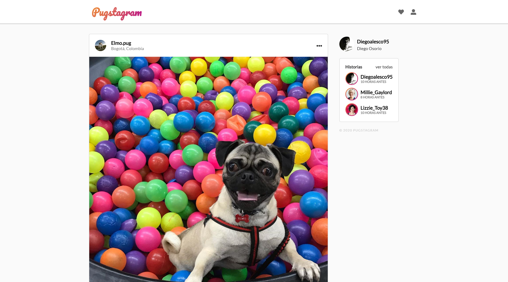

# Pugstagram, la red social de Pugs

¡Bienvenido y gracias por visitarme! Este es un proyecto elaborado como proyecto de aprendizaje de Svelte en [Platzi](https://platzi.com/cursos/svelte/) en donde aplico varios de los conocimientos y habilidades adquiridas, entre ellas:

- Entender la estructura del Framework Svelte
- Configurar un entorno para desarrollar una aplicación con Svelte
- Desarrollar una aplicación con Svelte
- Desplegar una webapp a producción

En este curso realizaremos una aplicación muy parecida a Instagram, llamada _Pugstagram_. 

Utilizaremos como empaquetador y transpilador:

- [Webpack](https://webpack.js.org/concepts/)
- [Babel](https://babeljs.io/)

Deploy con:

- [Deply con Now](https://vercel.com/home)

## Vista de Home

## [Ver la aplicación]([https://pugstagram-diegoalesco95.netlify.app])

## ¿Cómo funciona?

Si desea clonar el proyecto es necesario contar con Node.JS 12.6.x y seguir las siguientes instrucciones.

- `npm install` para instalar las dependencias.
- `npm run start` para el entorno de desarrollo.
- `npm run build` para el entorno de producción.

## Licencia

[MIT License](LICENSE)
